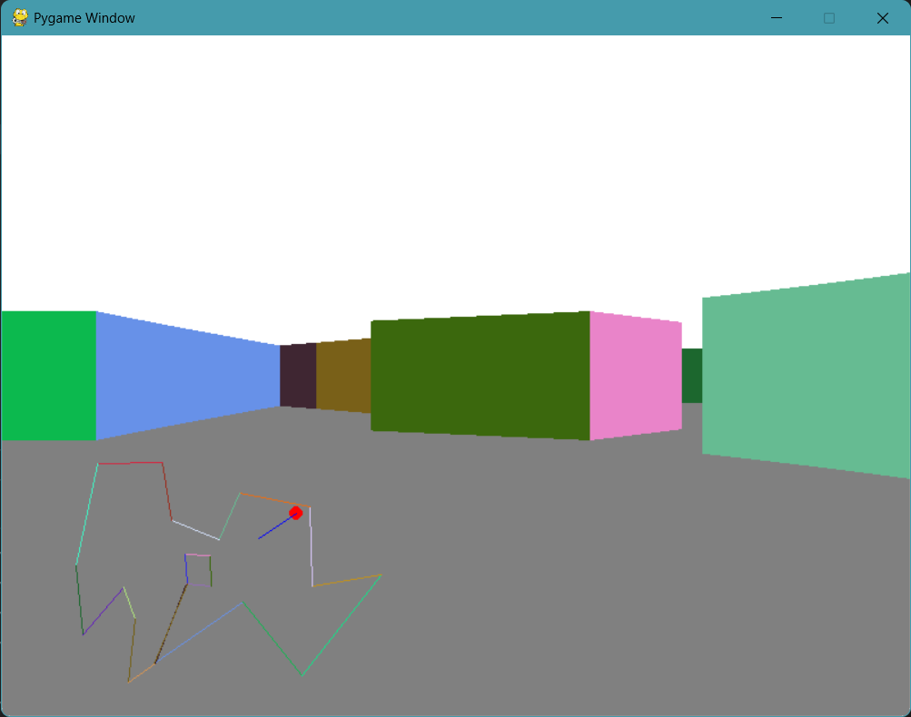

# Ray Casting 

A simple raycasting program using Pygame, employing a rendering technique akin to the classic FPS game Wolfenstein3D, although in this program, walls can have any degree with each other. The program scans through columns and detects collisions with walls. Walls are required to be vertical with the floor. I have plans to extend this into a game.

sample level :

